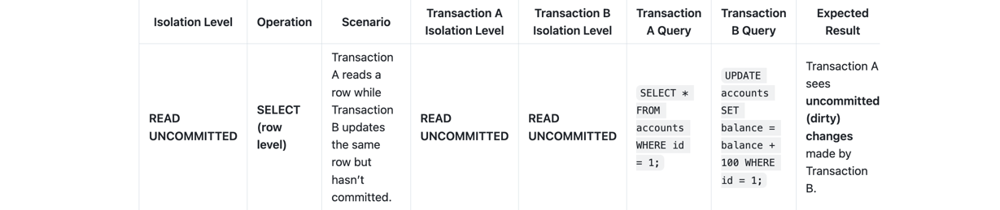
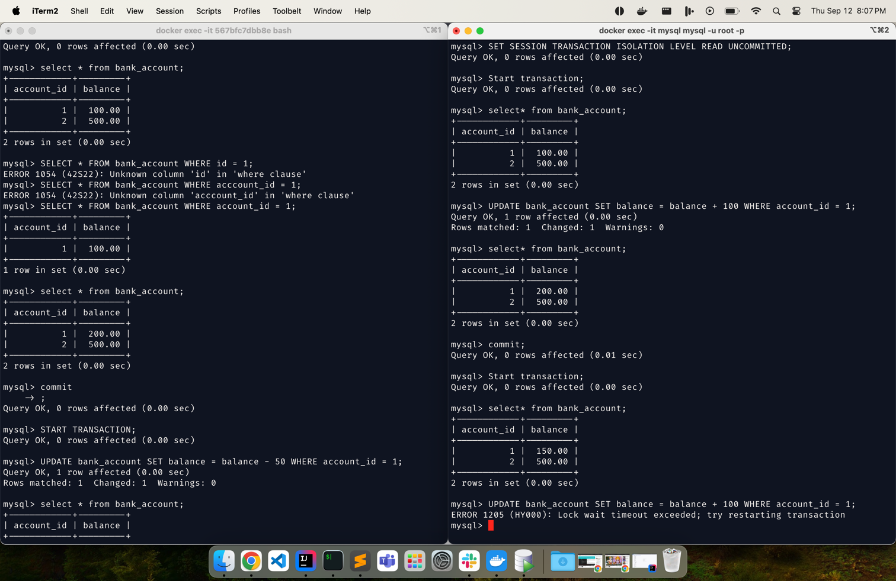
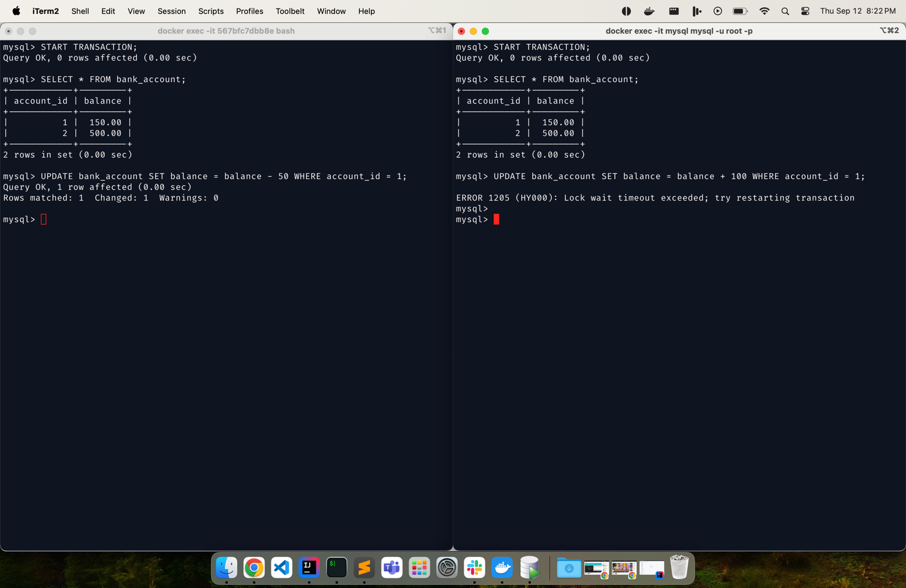
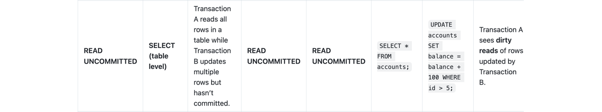
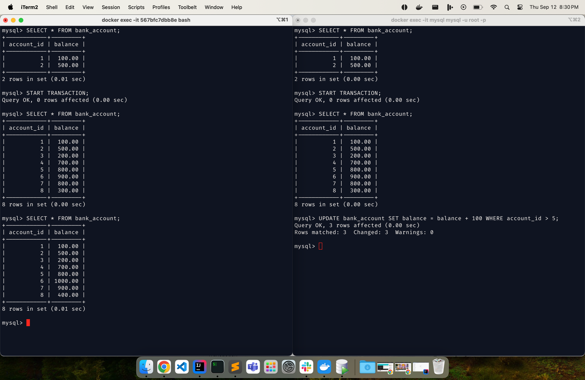
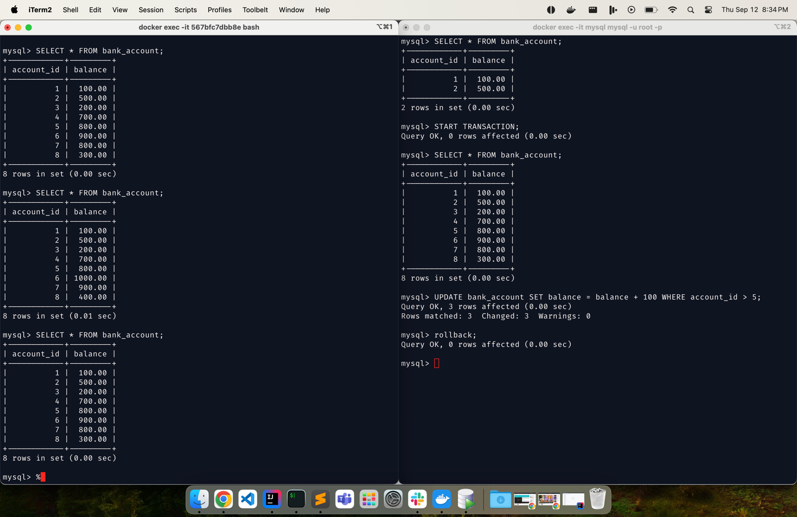
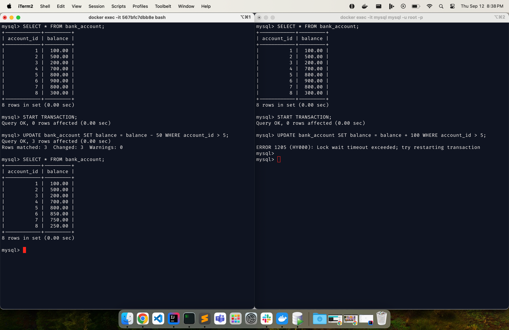

### READ UNCOMMITTED:

**1.** 



terminal A:

```declarative
step-1: SET SESSION TRANSACTION ISOLATION LEVEL READ UNCOMMITTED;
step-2: START TRANSACTION;
step-3: SELECT * FROM bank_account WHERE account_id = 1;
step-4: select * from bank_account;
step0-5: commit;
```
terminal B:
```declarative
step-1: SET SESSION TRANSACTION ISOLATION LEVEL READ UNCOMMITTED;
step-2: START TRANSACTION;
step-3: UPDATE bank_account SET balance = balance + 100 WHERE account_id = 1;
step-4: select * from bank_account;
step0-5: commit;
```





**2.** 


terminal A:

```declarative
step-1: START TRANSACTION;
step-2: UPDATE bank_account SET balance = balance - 50 WHERE account_id = 1;

OutPut:

Query OK, 1 row affected (0.00 sec)
Rows matched: 1  Changed: 1  Warnings: 0

```
terminal B:
```declarative
step-1: START TRANSACTION;
step-2: UPDATE bank_account SET balance = balance + 100 WHERE account_id = 1;

OutPut:

ERROR 1205 (HY000): Lock wait timeout exceeded; try restarting transaction

```




**3.**



terminal A:

```declarative
step-1: SELECT * FROM bank_account;
step-2: START TRANSACTION;
step-3: SELECT * FROM bank_account;
step-4: SELECT * FROM bank_account;
step-5: SELECT * FROM bank_account;
```
terminal B:
```declarative
step-1: SELECT * FROM bank_account;
step-2: START TRANSACTION;
step-3: SELECT * FROM bank_account;
step-3: UPDATE bank_account SET balance = balance + 100 WHERE account_id > 5;
```



after rollback;



**4.**


terminal A:

```declarative
step-1: SELECT * FROM bank_account;
step-2: START TRANSACTION;
step-3: UPDATE bank_account SET balance = balance - 50 WHERE account_id > 5;

OutPut:

Query OK, 1 row affected (0.00 sec)
Rows matched: 1  Changed: 1  Warnings: 0

step-4: SELECT * FROM bank_account;

```
terminal B:
```declarative
step-1: SELECT * FROM bank_account;
step-2: START TRANSACTION;
step-3: UPDATE bank_account SET balance = balance + 100 WHERE account_id > 5;

OutPut:

ERROR 1205 (HY000): Lock wait timeout exceeded; try restarting transaction

```


