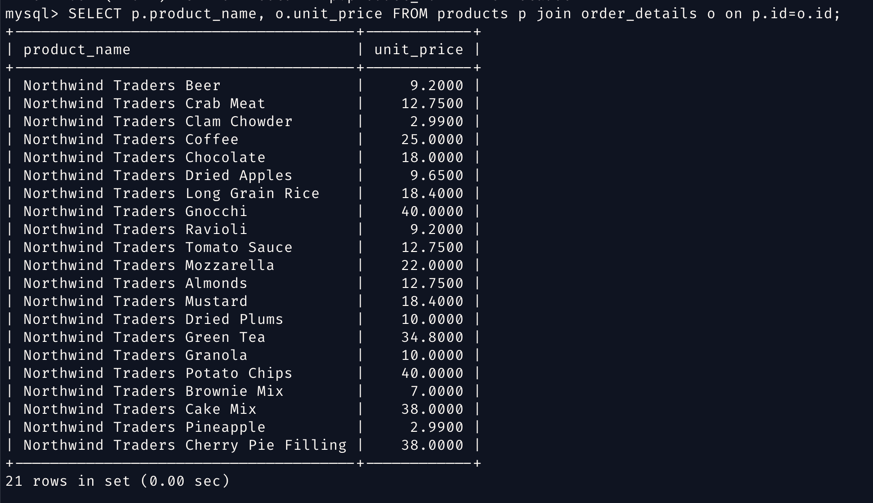
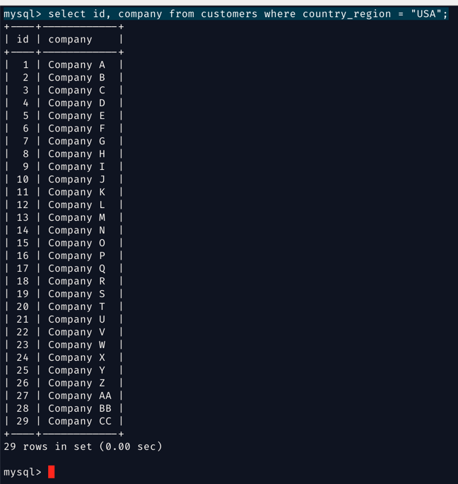

Do all the NorthWind database work in brand new MySQL container named `mysql_northwind`

`docker run --name mysql_northwind -e MYSQL_ROOT_PASSWORD=password123  -p 3307:3306 -e MYSQL_EXTRA_FLAGS="--max_connections=50"  bitnami/mysql:latest`


run the northwind database scripts on the mysql client

first login

`mysql -u root -p -h 127.0.0.1 -P 3307`

then

`source ~/Downlaods/northwind.sql`

`source ~/Downlaods/northwind-data.sql`


Here are SQL questions for the Microsoft Northwind database, categorized into Easy, Medium, and Difficult levels to help practice SQL skills:

### **Easy Level**
1. **List of Products**
    - Write a query to retrieve the `ProductName` and `UnitPrice` of all products from the `Products` table.
```declarative
SELECT p.product_name, o.unit_price FROM products p join order_details o on p.id=o.id;
```


```declarative
SELECT p.product_name, o.unit_price FROM products p join order_details o on p.id=o.id;
```

```
+--------------------------------------+------------+
| product_name                         | unit_price |
+--------------------------------------+------------+
| Northwind Traders Beer               |     9.2000 |
| Northwind Traders Crab Meat          |    12.7500 |
| Northwind Traders Clam Chowder       |     2.9900 |
| Northwind Traders Coffee             |    25.0000 |
| Northwind Traders Chocolate          |    18.0000 |
| Northwind Traders Dried Apples       |     9.6500 |
| Northwind Traders Long Grain Rice    |    18.4000 |
| Northwind Traders Gnocchi            |    40.0000 |
| Northwind Traders Ravioli            |     9.2000 |
| Northwind Traders Tomato Sauce       |    12.7500 |
| Northwind Traders Mozzarella         |    22.0000 |
| Northwind Traders Almonds            |    12.7500 |
| Northwind Traders Mustard            |    18.4000 |
| Northwind Traders Dried Plums        |    10.0000 |
| Northwind Traders Green Tea          |    34.8000 |
| Northwind Traders Granola            |    10.0000 |
| Northwind Traders Potato Chips       |    40.0000 |
| Northwind Traders Brownie Mix        |     7.0000 |
| Northwind Traders Cake Mix           |    38.0000 |
| Northwind Traders Pineapple          |     2.9900 |
| Northwind Traders Cherry Pie Filling |    38.0000 |
+--------------------------------------+------------+
21 rows in set (0.01 sec)

mysql>

```


2. **Customers in Specific Countries**
    - Retrieve the names of all customers (`CustomerID`, `CompanyName`) located in the USA from the `Customers` table.

```declarative
select id, company from customers where country_region = "USA";
```


```declarative

select concat(c.first_name,' ',c. last_name) as customer_name, o.customer_id, c.company from customers c join orders o on c.id = o.customer_id where c.country_region = 'USA';
```
```
+-------------------------+-------------+------------+
| customer_name           | customer_id | company    |
+-------------------------+-------------+------------+
| Anna Bedecs             |           1 | Company A  |
| Anna Bedecs             |           1 | Company A  |
| Thomas Axen             |           3 | Company C  |
| Thomas Axen             |           3 | Company C  |
| Thomas Axen             |           3 | Company C  |
| Christina Lee           |           4 | Company D  |
| Christina Lee           |           4 | Company D  |
| Christina Lee           |           4 | Company D  |
| Christina Lee           |           4 | Company D  |
| Christina Lee           |           4 | Company D  |
| Francisco Pérez-Olaeta  |           6 | Company F  |
| Francisco Pérez-Olaeta  |           6 | Company F  |
| Francisco Pérez-Olaeta  |           6 | Company F  |
| Francisco Pérez-Olaeta  |           6 | Company F  |
| Francisco Pérez-Olaeta  |           6 | Company F  |
| Francisco Pérez-Olaeta  |           6 | Company F  |
| Ming-Yang Xie           |           7 | Company G  |
| Ming-Yang Xie           |           7 | Company G  |
| Elizabeth Andersen      |           8 | Company H  |
| Elizabeth Andersen      |           8 | Company H  |
| Elizabeth Andersen      |           8 | Company H  |
| Elizabeth Andersen      |           8 | Company H  |
| Elizabeth Andersen      |           8 | Company H  |
| Elizabeth Andersen      |           8 | Company H  |
| Sven Mortensen          |           9 | Company I  |
| Sven Mortensen          |           9 | Company I  |
| Roland Wacker           |          10 | Company J  |
| Roland Wacker           |          10 | Company J  |
| Roland Wacker           |          10 | Company J  |
| Roland Wacker           |          10 | Company J  |
| Peter Krschne           |          11 | Company K  |
| Peter Krschne           |          11 | Company K  |
| John Edwards            |          12 | Company L  |
| John Edwards            |          12 | Company L  |
| John Rodman             |          25 | Company Y  |
| John Rodman             |          25 | Company Y  |
| Run Liu                 |          26 | Company Z  |
| Run Liu                 |          26 | Company Z  |
| Karen Toh               |          27 | Company AA |
| Karen Toh               |          27 | Company AA |
| Amritansh Raghav        |          28 | Company BB |
| Amritansh Raghav        |          28 | Company BB |
| Amritansh Raghav        |          28 | Company BB |
| Amritansh Raghav        |          28 | Company BB |
| Soo Jung Lee            |          29 | Company CC |
| Soo Jung Lee            |          29 | Company CC |
| Soo Jung Lee            |          29 | Company CC |
| Soo Jung Lee            |          29 | Company CC |
+-------------------------+-------------+------------+
48 rows in set (0.00 sec)

mysql>

```

3. **Order Details for a Specific Order**
    - Write a query to fetch the `ProductID`, `Quantity`, and `UnitPrice` for a specific order (OrderID: 10248) from the `Order Details` table.

4. **Count of Employees**
    - Write a query to count the total number of employees in the `Employees` table.

```declarative
select count(*) as total_employee from employees;
```
```
+----------------+
| total_employee |
+----------------+
|              9 |
+----------------+
1 row in set (0.00 sec)

mysql>

```

5. **List of Categories**
    - Display all the categories (`CategoryID`, `CategoryName`) from the `Categories` table.

6. **Products with Stock Less Than 10**
    - List all products (`ProductName`) that have a stock quantity (`UnitsInStock`) of less than 10 in the `Products` table.

### **Medium Level**
1. **Orders Placed by a Specific Customer**
    - Write a query to fetch the `OrderID`, `OrderDate`, and `ShipCountry` for orders placed by the customer with `CustomerID` "ALFKI".

2. **Product Sales Summary**
    - Write a query to calculate the total sales for each product. Use `ProductID`, `Quantity`, and `UnitPrice` from the `Order Details` table to compute the total sales amount.

3. **Employee Sales by Country**
    - Write a query to display each employee's full name (`FirstName`, `LastName`) and the total number of orders they handled, grouped by their `Country` of residence in the `Employees` table.

4. **List of Products by Supplier**
    - Write a query to list the `SupplierID`, `CompanyName` (from `Suppliers`), and all `ProductNames` they supply, using a JOIN between the `Products` and `Suppliers` tables.

5. **Top 5 Most Expensive Products**
    - Write a query to list the top 5 products with the highest unit price (`UnitPrice`) in descending order from the `Products` table.

6. **Orders Shipped After the Order Date**
    - Write a query to find all orders where the `ShippedDate` is greater than the `OrderDate` in the `Orders` table.

### **Difficult Level**
1. **Customers with No Orders**
    - Write a query to find all customers (`CustomerID`, `CompanyName`) who have not placed any orders. (Hint: Use a LEFT JOIN between `Customers` and `Orders` and filter out NULLs.)

2. **Total Sales by Country**
    - Write a query to compute the total sales amount (sum of `Quantity * UnitPrice` from `Order Details`) for each country, using data from `Orders`, `Order Details`, and `Customers` tables.

3. **Employee Order Summary**
    - Write a query to generate a summary report for each employee showing their `EmployeeID`, full name (`FirstName`, `LastName`), total number of orders they handled, and the sum of sales (`Quantity * UnitPrice`). Use a JOIN between `Employees`, `Orders`, and `Order Details`.

4. **Products with Higher than Average Price in Their Category**
    - Write a query to list all products (`ProductID`, `ProductName`) that have a price (`UnitPrice`) higher than the average price of products within their respective category. (Hint: Use a subquery to calculate the average price by category.)

5. **Monthly Sales Report**
    - Write a query to display the total sales amount (sum of `Quantity * UnitPrice`) grouped by month and year of the `OrderDate` in the `Orders` table. (Hint: Use date functions to extract month and year.)

6. **Identify Customers with Repeat Orders**
    - Write a query to identify customers (`CustomerID`, `CompanyName`) who have placed more than one order. (Hint: Use the `GROUP BY` clause with a `HAVING` condition.)

These questions provide a range of difficulty and cover various SQL concepts, including basic retrieval, aggregation, filtering, and joining across multiple tables.